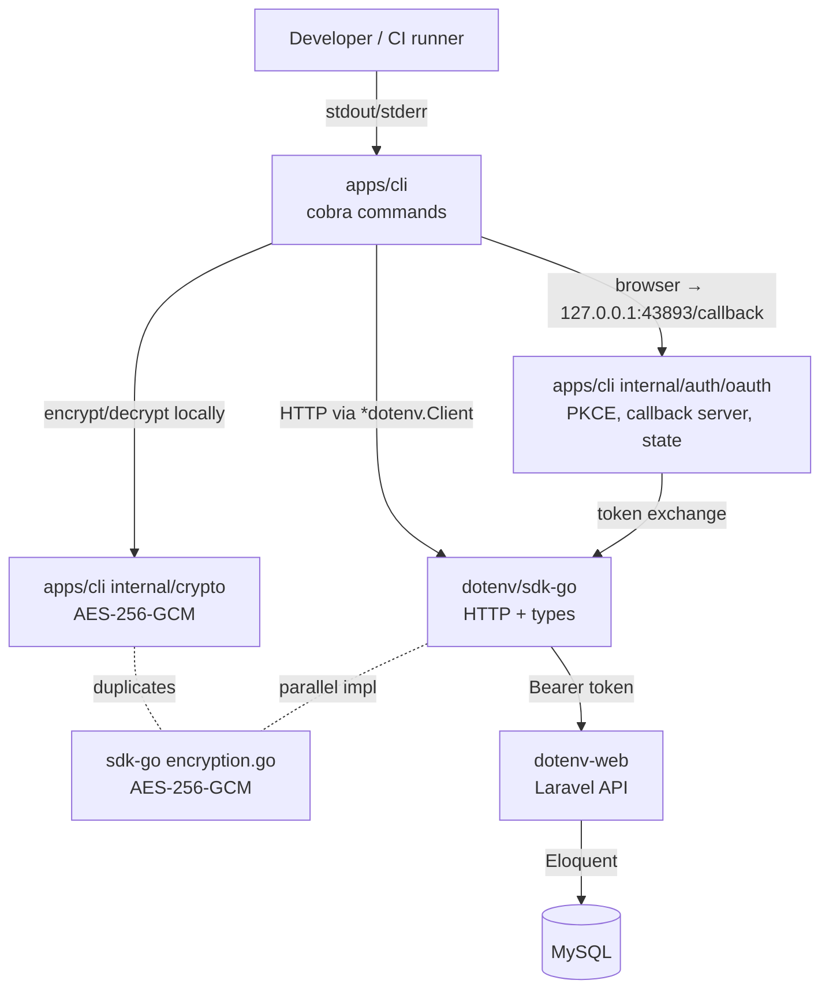

# DotEnv CLI Audit — 2026-05-25

> Read-only audit. No source changes were made. Scope: `apps/cli` (this repo) with cross-references to linked workspaces `sdk-go` and `dotenv-web` for contract analysis.

---

## 1. Executive Summary

### 1.1 Health Scorecard

| Category | Score | Notes |
|---|---|---|
| Architecture & Layering | B | Clear CLI/SDK/Web layering; CLI duplicates SDK encryption. |
| Code Quality (SOLID / DRY / KISS) | C | God files (`list.go` 822 LOC), format-switch repetition, duplicate factories. |
| Security | A− | Strong crypto (AES-256-GCM), PKCE+state OAuth, 0600/0700 file perms; one race risk in completion cache. |
| Error Handling | C+ | Consistent `%w` wrapping; multiple silent `_` discards on account lookup. |
| Testing | C− | ~25 test files, weak coverage on `cmd/` runners (`push`, `list`, `account`, `org`). |
| Integration / API Contracts | C | Dual route formats (long+short) co-exist in Web; no API-Version header. |
| Tooling, Build & CI | A | GoReleaser, Cosign signing, multi-platform matrix. |
| Idiomatic Go | B− | Global state in root.go, `context.Background()` leaked, no godoc on exported handlers. |

### 1.2 Top 5 Critical Findings (fix before next release)

1. **F-01 — Completion cache race** (`cmd/completion.go:302-318`). Package-level `projectCache` + `projectCacheTime` read/written without a mutex. Shell completion runs concurrent invocations; first-class data race.
2. **F-02 — Silent account-error swallows** (`cmd/list.go:304, 322, 356, 404, 671`). `account, _ := getCurrentAccount()` discards error then passes possibly-nil `account` to `HandleAPIError`, masking auth/config breakage.
3. **F-05 — Duplicated AES-GCM crypto across CLI and SDK** (`internal/crypto/encryptor.go` vs `sdk-go/encryption.go`). Two independent implementations of the same primitive — drift here silently breaks decryption parity with the Web app.
4. **F-09 — No tests for `cmd/push.go`, `cmd/list.go runList/listAll`, `cmd/account.go`, `cmd/org.go`**. These are the most-used commands; encryption-aware push has zero unit coverage.
5. **F-10 + F-11 — Implicit API versioning + duplicate Web routes** (Web `routes/api.php`). Long `/v1/organizations/{org}/...` and short `/v1/{org}/...` formats co-exist with no API-Version header; SDK hardcodes the short format — any breaking change to either branch silently breaks the CLI.

### 1.3 Strengths Worth Keeping

- Multi-language encryption parity (Go CLI, Go SDK, PHP Web) covered by `test/compatibility/encryption_compatibility_test.go`.
- OAuth flow correctly implements PKCE (`internal/auth/oauth/flow.go:48`) AND state validation (`internal/auth/oauth/server.go:101`).
- File permissions: 0600 for secret output, 0700 for config dir — correct defaults.
- Consistent `fmt.Errorf("...: %w", err)` wrapping across error paths.
- Strong release/CI: GoReleaser, Cosign signing, SBOM, multi-platform matrix, Docker non-root user.

---

## 2. Scope & Methodology

### Reviewed
- **CLI repo** (`apps/cli`, this workspace, 7,507 LOC across `cmd/`): all top-10 files read in full.
- **SDK** (`/Users/nsouto/.polyscope/clones/50cf0427/stormy-donkey`): `client.go`, `secrets.go`, `encryption.go`, `oauth.go` read in full.
- **Web API surface** (`/Users/nsouto/.polyscope/clones/e1f29e42/stormy-donkey`): `routes/api.php`, `UnifiedApiTokenMiddleware.php`, `GetSecretsAction.php`, `GetEncryptionKeyAction.php` read in full.

### Tools
- Targeted file reads (Read tool) on largest / highest-risk files.
- Glob inventory for tests + `.bak` files.
- Cross-reference of SDK method calls against Web route definitions.

### Out of scope
- Fixing any finding (report-only per user choice).
- Refactoring or editing source.
- SDK / Web App workspace modifications (read-only references).
- Running tests, building binaries, or opening GitHub issues.
- Dependency CVE scan (no `govulncheck` run).

---

## 3. Architecture & Layering

### 3.1 Component Diagram

### 3.2 Boundary Ownership

| Concern | Owner | Notes |
|---|---|---|
| HTTP transport, retries, JSON:API parsing | SDK | `client.go`, `secrets.go` |
| Auth headers (Bearer for both API key + OAuth) | SDK | `client.go:194-204` |
| OAuth token exchange / refresh (HTTP only) | SDK | `oauth.go` |
| OAuth browser/PKCE/state/callback orchestration | CLI | `internal/auth/oauth/{flow.go, server.go, pkce.go}` |
| Secret encryption/decryption | **Both** (duplicate) | `internal/crypto/encryptor.go` + `sdk-go/encryption.go` |
| Account / config persistence | CLI | `internal/config` |
| Hierarchy merge / format conversion | CLI | `internal/hierarchy`, `internal/formats` |
| Server-side decryption | Web | `GetSecretsAction::decryptLevels()` |
| Plaintext key escrow (server-managed mode) | Web | `GetEncryptionKeyAction` returns raw key |

### 3.3 Layering Violations / Smells

- **CLI re-implements crypto already in SDK.** CLI has its own `GCMEncryptor` (`internal/crypto/encryptor.go:31-80`) instead of calling `dotenv.Encrypt`/`dotenv.Decrypt` (`sdk-go/encryption.go:115`, `:147`). Both impls have identical `padKey` (12 bytes nonce, AES-256-GCM, base64) — drift risk.
- **SDK `secrets.go` hardcodes the *short* URL format** (`/api/v1/{org}/{project}/secrets`, `secrets.go:24-29`) while the Web app still exposes BOTH long and short routes (`routes/api.php:97-99` vs `:128-130`). No header negotiation.
- **CLI bypasses the SDK for unauthenticated calls** via `getUnauthenticatedSDKClient` (`cmd/helpers.go:207-214`) — acceptable, but it still constructs a real SDK client; just no token. Worth documenting.

---

## 4. CLI ↔ SDK ↔ API Integration

### 4.1 SDK Methods Consumed by CLI (inventory)

| SDK service.method | Used in CLI | Web route hit |
|---|---|---|
| `Organizations.List` | `cmd/list.go:298` | `GET /api/v1/organizations` |
| `Projects.List` | `cmd/list.go:402, 669`, `cmd/completion.go:169`, `cmd/tree.go`, `cmd/explore.go` | `GET /api/v1/{org}/projects` (short) |
| `Projects.Get` | `cmd/push.go:150` | `GET /api/v1/{org}/{project}` |
| `Targets.List` | `cmd/list.go:485, 682, 728`, `cmd/push.go:296, 333`, `cmd/completion.go:219` | `GET /api/v1/{org}/{project}/targets` |
| `Environments.List` | `cmd/list.go:570, 692, 743`, `cmd/push.go:361`, `cmd/completion.go:282` | `GET /api/v1/{org}/{project}/{target}/environments` |
| `Secrets.GetProjectSecrets` | `cmd/pull.go:142` | `GET /api/v1/{org}/{project}[/{target}[/{environment}]]/secrets` |
| `Secrets.List` | `cmd/push.go:244` | `GET /api/v1/{org}/{project}/secrets` (same path, different shape — JSON:API list vs hierarchy) |
| `Secrets.BulkCreate` → `PushSecrets` | `cmd/push.go:263, 442` | `POST /api/v1/{org}/{project}/secrets/push` |
| `Encryption.GetEncryptionKey` | `cmd/pull.go:293`, `cmd/push.go:174` | `GET /api/v1/{org}/{project}/encryption-key` |
| `OAuth.ExchangeToken` | `internal/auth/oauth/flow.go:117` | `POST /api/oauth/token` (PUBLIC) |
| `OAuth.RefreshToken` | `internal/auth/token_manager.go` (via factory) | `POST /api/oauth/token` |
| `User.GetAuthenticatedUser` | `internal/auth/oauth/flow.go:315` | `GET /api/v1/user` |

### 4.2 Encryption Duplication — Medium severity

`internal/crypto/encryptor.go` and `sdk-go/encryption.go` implement the same AES-256-GCM pipeline (`padKey` → AES-256 → GCM 12B nonce → base64). CLI uses its own; SDK package-level `Encrypt/Decrypt` go unused by CLI. The Web app uses Laravel's `EncryptionService::decryptWithProjectKey` (`GetSecretsAction.php:162`). Three implementations, one wire format. Parity is currently verified by `test/compatibility/encryption_compatibility_test.go` — but that is a snapshot, not a structural guarantee.

### 4.3 OAuth Split — acceptable

SDK handles only the token exchange / refresh HTTP calls (`sdk-go/oauth.go`). CLI owns browser launch, local callback server, port pool 43893-43895, PKCE generation, state generation/validation, and 5-min timeout (`internal/auth/oauth/flow.go:99`). Clean split — SDK stays headless.

### 4.4 Web API Contract Risks

| Risk | Where | Severity |
|---|---|---|
| Dual route formats: long `/v1/organizations/{org}/projects/{project}/secrets` AND short `/v1/{org}/{project}/secrets` both registered | `routes/api.php:97-99` vs `:128-130` | Med |
| No `API-Version` request/response header; version implicit in `/v1/` prefix | `client.go:NewRequest`, all routes | Low |
| `decrypt` / `merge` / `raw` parameter coupling enforced by `InvalidArgumentException` at runtime, not by type system | `GetSecretsAction.php:45-60` | Low |
| Client-managed encryption mode signals via HTTP 400 with no machine-readable error code; CLI relies on status alone | `cmd/pull.go:296`, `GetEncryptionKeyAction.php:27` | Med |
| Rate-limit asymmetry: `/oauth/token` `throttle:10,1`, organization API `api-rate-limit:api,100,1`, telemetry `throttle:60,1` — CLI does not surface 429 retry-after to caller | `routes/api.php:20, 37, 115`; `cmd/errors.go:43` | Low |
| `Secrets.List` and `Secrets.GetProjectSecrets` hit the SAME route path with different expected response shapes (flat array vs hierarchy envelope); routing depends on whether `?merge` / `?decrypt` query params are present | SDK `secrets.go:24, 119`, Web `PublicSecretController::index` | Med |
| `extractResourceFromURL` (SDK `client.go:327`) parses paths heuristically — adding a new resource type without updating this map silently degrades error messages | `client.go:336-359` | Low |

---

## 5. Code Quality

### 5.1 SOLID

- **SRP — `cmd/list.go` (822 LOC) is a god file.** `runList` (188 LOC) dispatches to 6 different resource branches, each of which inlines its own format switch. Suggested split: `cmd/list/{accounts,orgs,projects,targets,environments,all}.go`.
- **SRP — `runPull` (`cmd/pull.go:97-243`)** mixes path parsing, API call, decryption-key fetch, hierarchical merge, format conversion, file backup, and stdout/file I/O. Decomposable into ≥4 helpers.
- **OCP — output-format switches duplicated 8+ times** (`switch listFormat { case "json": ... case "yaml": ... default: table ...}` in `cmd/list.go:169, 313, 421, 503, 588, 766`; same shape in `cmd/account.go` / `cmd/org.go`). Calls for an `OutputFormatter` interface.
- **DIP — `getAPIClient` vs `getAPIClientWithoutOrgContext`** (`cmd/helpers.go:18-68` vs `:160-203`) duplicate ~95% of logic. A single `getAPIClient(withOrg bool)` would suffice.

### 5.2 DRY

- Account + config loading (`config.ConfigPath()` → `config.NewAccountManager(...)`) is repeated in `cmd/helpers.go`, `cmd/account.go`, `cmd/org.go`, `cmd/root.go:187`. Factor into a single `loadAccountManager()`.
- `account, _ := getCurrentAccount()` followed by `currentOrgID := ...` block appears 2x in `cmd/list.go:322-330` and `:356-364` — identical 8-line block.
- Triple-nested `project → target → environment` `List` loops appear in `cmd/list.go:676-702` (paths) and `:719-759` (full), `cmd/tree.go`, `cmd/explore.go`. Worth a single `walkHierarchy(client, fn)` helper.
- `listFormat` switch with `json` / `yaml` / default-table branches appears in every list function in `cmd/list.go`.

### 5.3 KISS

- `runList` 188 LOC; `listAll` 173 LOC with 5-level nesting (`for project { for target { for env { ... } } }`).
- `cmd/errors.go:144-157` reimplements `contains` and `findSubstring` with bespoke bounds checks instead of using `strings.Contains`.
- `cmd/list.go:509-511` inline anonymous struct embedding to patch JSON shape (`type targetWithPath struct { *dotenv.Target; Path string }`); fine as a one-off but repeated for `projectWithPath` (`:427`) and `envWithPath` (`:594`).
- `cmd/push.go:316-321` matches selected target by `strings.Contains(selected, t.Slug)` — substring match on a display string. Brittle: if a slug is a prefix of another slug, wrong target may be selected.

### 5.4 Idiomatic Go

- Globals in `cmd/root.go:18-26`: `cfgFile`, `debug`, `quiet`, `noColor`, `globalAPIKey`, `telemetryClient`, `commandStart`. Test isolation suffers.
- `context.Background()` is hardcoded everywhere: `cmd/list.go:298, 402, 485, 570, 669, 682, 692, 728, 743`; `cmd/pull.go:142, 293`; `cmd/push.go:150, 174`. Cobra already gives `cmd.Context()` — propagate it.
- Exported handler functions (e.g. `RefreshOrganizationsIfNeeded`, `HandleAPIError`) lack godoc; many internal helpers have it. Inconsistent.
- `cmd/root.go:30` declares `var rootCmd *cobra.Command` and `init()` sets it; but tests also need `NewRootCommand()` (line 33). The two paths exist in parallel, easy to mis-use.
- `cmd/root.go:222`: `loader.Save(cfg)` return value ignored — config write failure swallowed.

---

## 6. Error Handling

| Pattern | Where | Verdict |
|---|---|---|
| Consistent `fmt.Errorf("...: %w", err)` wrapping | `cmd/pull.go:194, 220, 230`, `cmd/push.go:155, 444` | ✅ |
| Silent error discard: `account, _ := getCurrentAccount()` then passed to `HandleAPIError(err, account)` where `account` may be nil | `cmd/list.go:304, 322, 356, 404, 671`; `cmd/pull.go:145, 304` | ❌ Surface or log. |
| `loader.Save(cfg)` return value ignored | `cmd/root.go:222` | ❌ |
| `ui.PrintWarning + continue` inside `listAll` swallows partial failures silently in the JSON/YAML output (only stderr warning) | `cmd/list.go:684, 694, 730, 745` | ⚠️ Acceptable for `--paths` UX; JSON consumers can't see partial failure. |
| `os.WriteFile` directory creation uses 0755, file uses 0600 | `cmd/pull.go:193, 219, 229` | ✅ |
| OAuth callback errors → channel | `internal/auth/oauth/server.go:69, 85-116` | ✅ |
| `telemetryClient.TrackCommand` success determined solely by `cmd.Context().Err()`; ignores RunE return error | `cmd/root.go:74` | ⚠️ Telemetry success flag may misreport command failures. |

---

## 7. Security

### 7.1 Positives
- **AES-256-GCM**, 12-byte nonce, base64 framing — industry baseline (`internal/crypto/encryptor.go:41-80`).
- **Weak-key detection** (all-zero / all-FF) rejects trivially bad keys (`encryptor.go:179-192`).
- **OAuth PKCE** generated per flow (`internal/auth/oauth/flow.go:48`).
- **OAuth state** generated, passed to callback server, and **validated** on callback (`internal/auth/oauth/server.go:101-105`).
- File permissions: secret output `0600` (`cmd/pull.go:219, 229`), config dir `0700` (`cmd/root.go:166`).
- No hardcoded credentials grep'd.
- API key never logged in plaintext; CLI accepts via flag, env var, or account store.
- Web side: Sanctum + UnifiedApiTokenMiddleware distinguishes org vs user tokens, applies per-permission middleware on every route.

### 7.2 Concerns / Trust Boundaries

| Item | Where | Notes |
|---|---|---|
| **Server-managed key mode** returns the **plaintext encryption key** to anyone with project read access | `GetEncryptionKeyAction.php:30-39` returns raw `$activeKey->key` | Documented as the contract, but worth explicit warning in CLI help when this path is taken. |
| **`padKey` pads with ASCII `'0'`** to 32 bytes (`encryptor.go:208`, `sdk-go/encryption.go:215`); accepts ANY non-empty key. A 1-byte key becomes `"x000...000"` (31× `'0'`) — drastically reduces keyspace silently. | Both crypto impls | Med — keep the silent padding only for backward-compat with the PHP impl, but emit a CLI warning when key < 32 bytes. |
| Custom contains / findSubstring used to switch on error message text (`cmd/errors.go:114-141`) | `cmd/errors.go` | Brittle: refactoring an error message string elsewhere silently changes help output. Use sentinel errors instead. |
| `DOTENV_TLS_SKIP_VERIFY=true` env var disables TLS verification globally (`sdk-go/client.go:127-131`); also `WithInsecureSkipVerify` ClientOption (`:82-92`) | SDK | Document loudly. Not a bug, but the env-var path is far too easy. |
| `SetTLSSkipVerify` (`sdk-go/client.go:305-314`) **replaces** the entire `httpClient` (losing any custom transport, timeout, or wrapper); same in `WithInsecureSkipVerify` | SDK | Don't replace — mutate the transport. |
| Input validation gaps on slug args | `cmd/list.go:101` (`resource := args[0]` then `args[1]` for project/target slug), `cmd/push.go:108` (`strings.Split(path, "/")`) | No regex / charset check before sending to API. API rejects invalid, but earlier failure is friendlier. |
| OAuth localhost callback served plain HTTP on 43893-43895 with no localhost-binding check (binds `:port`, not `127.0.0.1:port`) | `internal/auth/oauth/server.go:62` | Low risk on a workstation but binds on all interfaces. Should bind `127.0.0.1:`. |
| `cmd/push.go:317, 354, 383`: target/env selected by `strings.Contains(selected, t.Slug)` over display string | `cmd/push.go` | Substring collisions = wrong-target push. Use index, not substring. |
| `_, _ = loader.Save(cfg)` writes analytics ID without locking | `cmd/root.go:222` | Race between parallel `dotenv` invocations writing config. |

### 7.3 Encryption Parity (positive)
`test/compatibility/encryption_compatibility_test.go` exists; combined with the SDK's `padKey` matching the CLI's matching the PHP `EncryptionService` (per code comments at `encryptor.go:198` and `sdk-go/encryption.go:205`), parity is currently maintained. **Recommendation:** add CI gate that fails the SDK / CLI / Web builds if any of the three padKey / GCM nonce / base64 conventions drifts.

---

## 8. Testing

### 8.1 Inventory (25 test files)

| Area | Files | Verdict |
|---|---|---|
| `internal/crypto` | `encryptor_test.go`, `compatibility_test.go`, `modes_test.go`, `validation_test.go`, + 3 in `key/` | ✅ Strong, includes cross-language compat. |
| `internal/formats` | `formats_test.go`, `env/parser_test.go`, `interpolation/interpolator_test.go` | ✅ |
| `internal/hierarchy` | `builder_test.go`, `builder_nil_test.go` | ✅ |
| `internal/auth` | `token_manager_test.go` | ⚠️ Only token mgr; flow + server untested. |
| `internal/client` | `factory_test.go` | ✅ |
| `internal/config` | `api_test.go`, `integration_test.go` | ✅ |
| `internal/paths`, `internal/utils` | `paths_test.go`, `ulid_test.go` | ✅ |
| `cmd/` | `apikeys_test.go`, `auth_test.go`, `pull_test.go`, `pull_helpers_test.go` | ❌ Missing: `push`, `list` (runList, listAll), `account`, `org`, `tree`, `explore`, `init`, `login`, `update`. |
| `internal/telemetry`, `internal/ui`, `internal/interactive` | none | ❌ Gap. |
| `internal/auth/oauth` | none | ❌ PKCE + state validation untested. |
| Integration | `test/integration/{cli_test.go, commands_test.go}` | ⚠️ Limited — does not cover encrypted push. |

### 8.2 Ratio
Test LOC ≈ 1.5K vs `cmd/` LOC ≈ 7.5K → ~5:1, weak for the most user-facing layer.

### 8.3 Why `cmd/` is hard to test today
`getAPIClient()` returns a concrete `*dotenv.Client` from a package-level path (`cmd/helpers.go:18`); no injection point for a fake. A mock-factory pattern (or a `var apiClientFactory = getAPIClient` test-overridable hook) would unlock command tests.

### 8.4 No `.bak` files in tree (verified)
`Glob cmd/*.bak → No files found`. Earlier suspicion in the plan is RESOLVED — drop F-08 or close it.

---

## 9. Tooling, Build & CI

- **GoReleaser** with multi-platform matrix, Cosign signatures, SBOMs — top-tier release hygiene.
- **CI matrix:** Ubuntu / macOS / Windows × Go 1.21 / 1.22 / 1.23 (per `.github/workflows/test.yml` per index).
- **Dockerfile** uses non-root user.
- **Minor:** `go.mod` declares Go 1.23 toolchain but CI still tests 1.21 — confirm minimum-supported version is documented in README. (Otherwise users on 1.21 may hit features the test suite covers but the build does not allow.)
- No `govulncheck` step observed — recommend adding to CI.
- No race-detector run observed — strongly recommend `go test -race ./...` given F-01.

---

## 10. Findings Table

| ID | Severity | Category | File:Line | Issue | Recommendation |
|---|---|---|---|---|---|
| F-01 | **High** | Concurrency | `cmd/completion.go:302-318` | `projectCache` / `projectCacheTime` read+written without mutex; multiple shell completion calls race. | Wrap in `sync.RWMutex` or use `sync/atomic` for the slice pointer + time. |
| F-02 | **High** | Errors | `cmd/list.go:304, 322, 356, 404, 671`; `cmd/pull.go:145, 304` | `account, _ := getCurrentAccount()` then `HandleAPIError(err, account)` — `account` may be nil; original error swallowed. | Either propagate the error or log it via `ui.PrintWarning` before re-using. |
| F-03 | Med | DRY | `cmd/helpers.go:18-68, 160-203` | `getAPIClient` and `getAPIClientWithoutOrgContext` duplicate ~95% of logic. | Single `getAPIClient(withOrg bool)`. |
| F-04 | Med | SRP | `cmd/list.go` (822 LOC) | God file; 6 resource branches × 3 output formats inlined. | Split per resource + `OutputFormatter` interface. |
| F-05 | Med | Integration | `internal/crypto/encryptor.go` vs `sdk-go/encryption.go` | AES-GCM duplicated across CLI + SDK; parity guarded only by snapshot tests. | CLI imports SDK `dotenv.Encrypt/Decrypt`; deprecate `internal/crypto/GCMEncryptor`. |
| F-06 | Med | Idiomatic | `cmd/list.go:298, 402, 485, 570, 669, 682, 692, 728, 743`; `cmd/pull.go:142, 293`; `cmd/push.go:150, 174` | `context.Background()` hardcoded; cancellation/timeout from cobra context lost. | Use `cmd.Context()`. |
| F-07 | Low | Idiomatic | `cmd/errors.go:144-157` | Custom `contains` / `findSubstring` reimplementing stdlib. | Replace with `strings.Contains`. |
| F-08 | ~~Low~~ Resolved | Hygiene | `cmd/*.bak` | None found in tree. | Close — no action needed. |
| F-09 | Med | Tests | `cmd/push.go`, `cmd/list.go runList/listAll`, `cmd/account.go`, `cmd/org.go`, `internal/auth/oauth/*`, `internal/telemetry`, `internal/ui` | Largest, most-used files have zero unit tests; OAuth state/PKCE untested. | Introduce a `var apiClientFactory` hook for cmd-layer mocking; target ≥60% on `cmd/`. |
| F-10 | Low | API | `sdk-go` ↔ Web `routes/api.php` | Implicit versioning via `/v1/` prefix; no `API-Version` header. | Add `X-API-Version: 1` request header and response echo. |
| F-11 | Low | API | Web `routes/api.php:74-117` vs `:122-159` | Long `/v1/organizations/{org}/...` AND short `/v1/{org}/...` formats both live; SDK uses only short. | Document deprecation window; SDK should set a header signalling intended format. |
| F-12 | Info | Security | `internal/auth/oauth/flow.go:48`, `server.go:101` | State + PKCE verified present and validated. | Add explicit unit tests covering state mismatch. |
| F-13 | Med | Security | `internal/crypto/encryptor.go:199-211`; `sdk-go/encryption.go:206-218` | `padKey` accepts ANY non-empty key, pads with `'0'`. 1-byte key → near-constant 32-byte key. | Emit warning when supplied key < 32 bytes; reject in strict mode. |
| F-14 | Med | Concurrency | `cmd/root.go:222` (`loader.Save(cfg)` for analytics ID) | No file lock; concurrent `dotenv` calls race the YAML write; error ignored. | Use atomic write (tmp+rename) + check return. |
| F-15 | Low | Security | `internal/auth/oauth/server.go:62` | Callback server binds `:port` (all interfaces). | Bind `127.0.0.1:{port}` only. |
| F-16 | Med | Correctness | `cmd/push.go:317, 354, 383` | Target / env selection via `strings.Contains(selectedDisplayString, slug)` — substring collisions select the wrong resource. | Map index → resource and compare by index, not substring. |
| F-17 | Low | API | SDK `client.go:305-314, 82-92` | `SetTLSSkipVerify` and `WithInsecureSkipVerify` REPLACE the `httpClient`, dropping custom transports/timeouts. | Mutate the existing transport instead. |
| F-18 | Low | API | SDK `client.go:327-372` | `extractResourceFromURL` heuristic parser; silently degrades to `"resource"` when route shape changes. | Move resource extraction into each service / pass through a typed `Op`. |
| F-19 | Med | Contract | `GetSecretsAction.php:45-60` + `cmd/pull.go:296` | `decrypt`/`merge`/`raw` coupling enforced by exception; client-managed mode signalled by HTTP 400 with no error code. | Add explicit error code (`error: "client_managed_encryption"`) in JSON envelope; SDK maps to typed error. |
| F-20 | Low | Idiomatic | `cmd/root.go:222` | Config write error from `loader.Save(cfg)` discarded. | Check `err`. |
| F-21 | Low | Hygiene | `cmd/list.go:142` | Error message lists `text` as a valid resource: `"valid resources are accounts, organizations, projects, targets, environments, all, text"` — `text` is not in `ValidArgs:` nor handled in `switch`. Dead doc string. | Remove `, text`. |
| F-22 | Low | Telemetry | `cmd/root.go:64-79` | `success := cmd.Context().Err() == nil` — does not reflect `RunE` returning non-nil. | Capture `RunE` error in a closure and use it. |

---

## 11. Quick Wins (1-day)

- F-07 — Replace custom `contains` / `findSubstring` with `strings.Contains` (`cmd/errors.go:144-157`).
- F-01 — Add `sync.RWMutex` around `projectCache` in `cmd/completion.go:302`.
- F-02 — Surface the swallowed `getCurrentAccount` errors via `ui.PrintWarning` before fall-through.
- F-15 — Bind callback server on `127.0.0.1` not `:` (`internal/auth/oauth/server.go:62`).
- F-20, F-21 — Trivial doc-string + error-check fixes.
- Add a CI step: `go test -race ./...`.

---

## 12. Medium-Term (1-2 weeks)

- F-03 — Consolidate `getAPIClient` / `getAPIClientWithoutOrgContext` into one function with a `withOrg bool` arg.
- F-06 — Propagate `cmd.Context()` through every `client.*.List/Get/...` call in `cmd/`.
- F-09 (partial) — Introduce `var apiClientFactory = getAPIClient` so command tests can swap; backfill tests for `runPull`, `runPush`, `listAll`.
- Define an `OutputFormatter` interface (`Render(any) error`) and have list/account/org commands depend on it instead of inline `switch listFormat`.
- F-14 — Atomic config save (tmp file + rename) with `err` propagation.
- F-16 — Replace substring-match target/env selection with index-based picks in `cmd/push.go`.

---

## 13. Long-Term (>2 weeks)

- F-05 — Promote `sdk-go/encryption.go` Encrypt/Decrypt as the single source of truth; delete `internal/crypto/GCMEncryptor`; have CLI import the SDK function. Keep `internal/crypto/key` (key parsing) in the CLI.
- F-04 — Split `cmd/list.go` into `cmd/list/{accounts,orgs,projects,targets,environments,all}.go`.
- F-10 + F-11 — Add `X-API-Version: 1` header, schedule deprecation of the long route format on the Web side, and have the SDK + CLI set the header explicitly.
- F-19 — Standardise a JSON error envelope (`{error: "<code>", message: "..."}`) across the Web API; map to typed SDK errors.
- Build a `cmd/`-layer mock SDK and lift `cmd/` test coverage to ≥60%.
- Add `govulncheck` to CI; add a parity-matrix CI job that runs encryption tests across Go CLI, Go SDK, and PHP Web on each PR.

---

## 14. Appendix

### 14.1 SDK Method ↔ Web Route Cross-Reference

| SDK call | HTTP | Web route (api.php) | Action |
|---|---|---|---|
| `Organizations.List` | GET | `/v1/organizations` (line 42) | `OrganizationsController@index` |
| `Projects.List` | GET | `/v1/{org}/projects` (124) | `ProjectController@index` |
| `Projects.Get` | GET | `/v1/{org}/{project}` (134) | `ProjectController@show` |
| `Targets.List` | GET | `/v1/{org}/{project}/targets` (149) | `TargetController@index` |
| `Environments.List` | GET | `/v1/{org}/{project}/{target}/environments` (155) | `EnvironmentController@index` |
| `Secrets.GetProjectSecrets` | GET | `/v1/{org}/{project}[/{target}[/{env}]]/secrets` (128-130) | `PublicSecretController@index` |
| `Secrets.List` | GET | (same path as above) | `PublicSecretController@index` |
| `Secrets.BulkCreate` → `PushSecrets` | POST | `/v1/{org}/{project}/secrets/push` (not in long form; via short form) | (separate controller) |
| `Encryption.GetEncryptionKey` | GET | `/v1/{org}/{project}/encryption-key` (139) | `EncryptionKeyController@show` → `GetEncryptionKeyAction` |
| `OAuth.ExchangeToken` / `RefreshToken` | POST | `/oauth/token` (19) | `OAuthController@token` |
| `User.GetAuthenticatedUser` | GET | `/v1/user` (39) | `UserController` (invokable) |

### 14.2 CLI File-Size Leaderboard (`cmd/`)

| LOC | File |
|---|---|
| 822 | `cmd/list.go` |
| 486 | `cmd/push.go` |
| 484 | `cmd/pull.go` |
| 447 | `cmd/apikeys_test.go` |
| 446 | `cmd/account.go` |
| 431 | `cmd/org.go` |
| 404 | `cmd/auth_test.go` |
| 403 | `cmd/pull_test.go` |
| 372 | `cmd/apikeys.go` |
| 360 | `cmd/explore.go` |
| 318 | `cmd/completion.go` |
| 306 | `cmd/tree.go` |
| 280 | `cmd/update.go` |
| 258 | `cmd/init.go` |
| 243 | `cmd/pull_helpers_test.go` |
| 238 | `cmd/root.go` |
| 217 | `cmd/path.go` |
| 214 | `cmd/helpers.go` |
| 170 | `cmd/login.go` |

Total `cmd/`: 7,507 LOC.

### 14.3 Verified Positives (not findings)

- OAuth state validation: `internal/auth/oauth/server.go:101` (`if state != s.ExpectedState`).
- OAuth PKCE: `internal/auth/oauth/flow.go:48` (challenge gen), `:113` (verifier passed to token exchange).
- File perms: 0600 secret output (`cmd/pull.go:219, 229`), 0700 config dir (`cmd/root.go:166`).
- Encryption format identical across CLI ↔ SDK ↔ PHP (covered by `test/compatibility/encryption_compatibility_test.go`).
- API key auth bypasses account system for CI/CD (`cmd/helpers.go:31-36`) — clean fallback.

---

*End of audit.*
